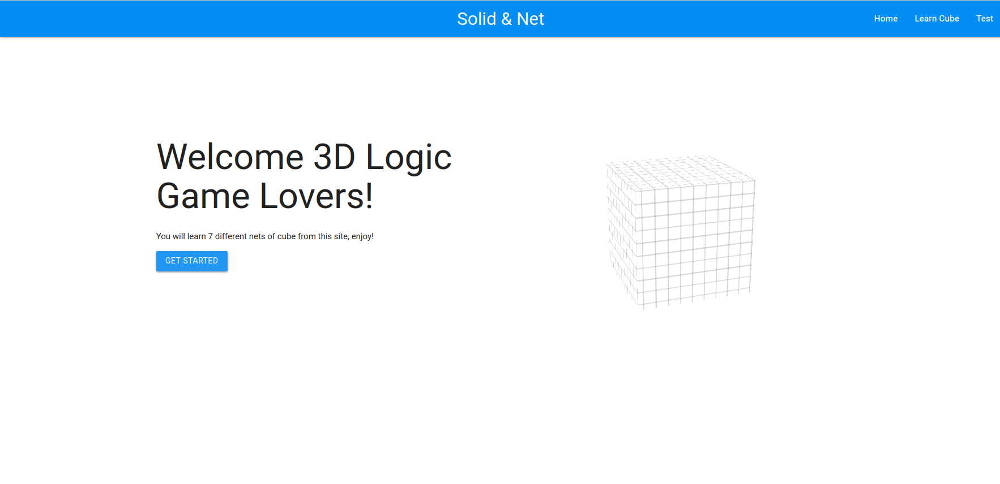

# UI-Design-H7-4
Columbia COMS4170 UI Design Group Project-H7-4

Solid-Net Transformation.



## Group Members:
- Paata Ugrekhelidze
- Yu Li
- Zixuan Zhou
- Kendall Downend

## Start App:
```python3 -m pip install flask```
```cd app/```
```python3 app.py```

## Branches:
- main - will merge with dev at the end of every week
- dev - will be used to branch out and merge weekly tasks (e.g. paata-test-page branches out of dev and merges back once the task is finished) 
